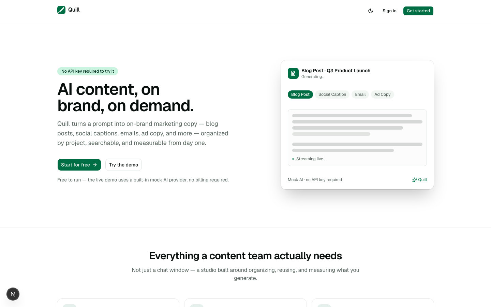
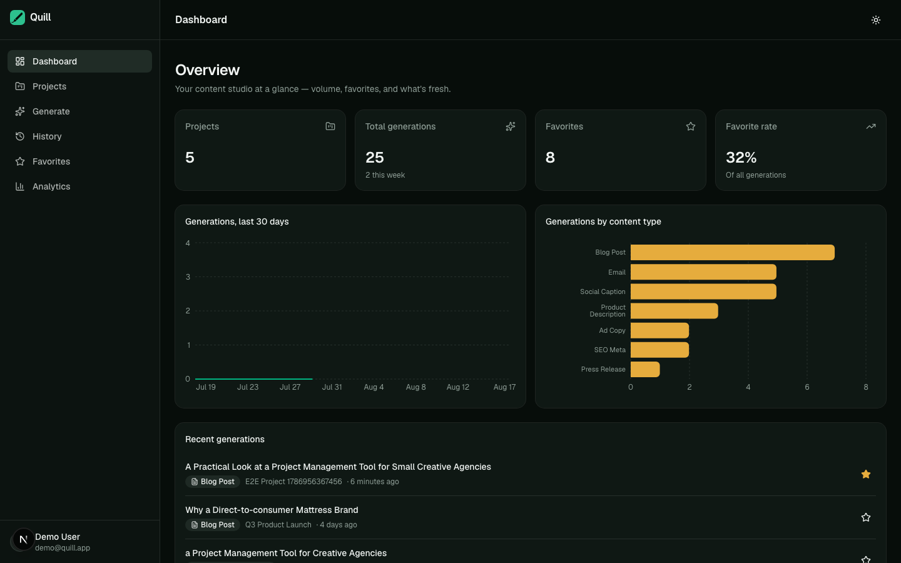
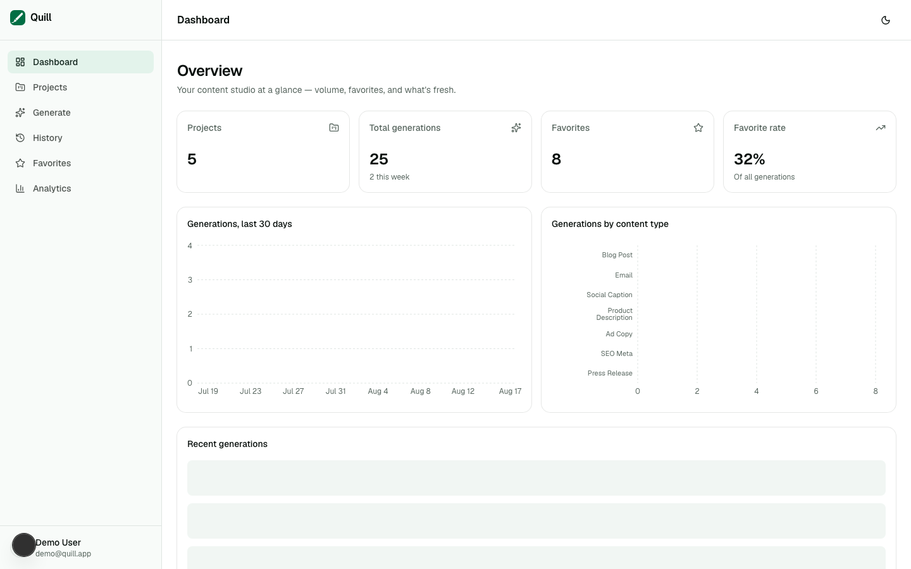
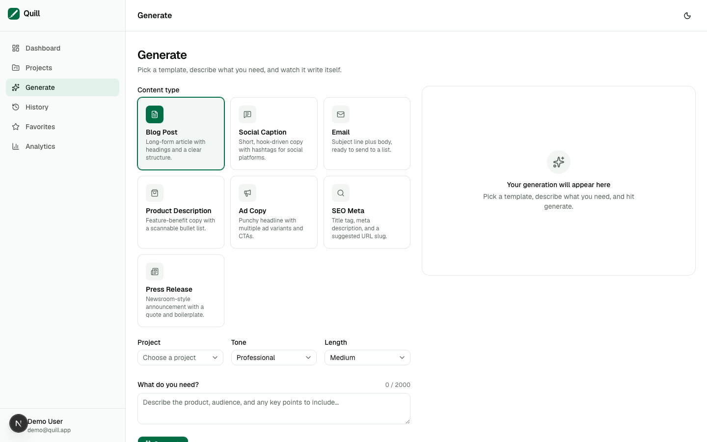
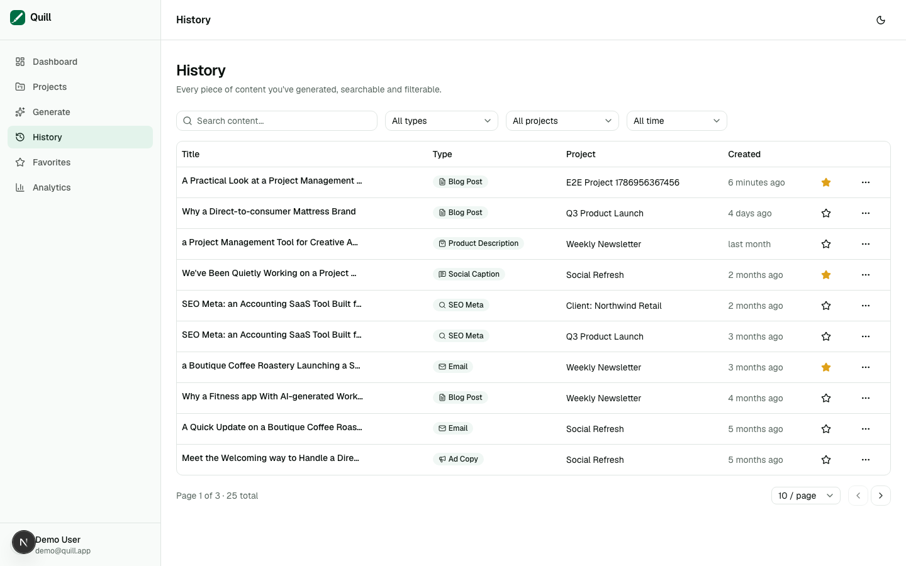
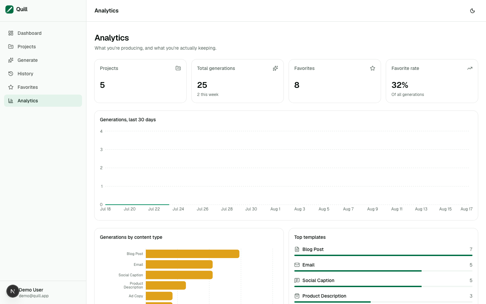
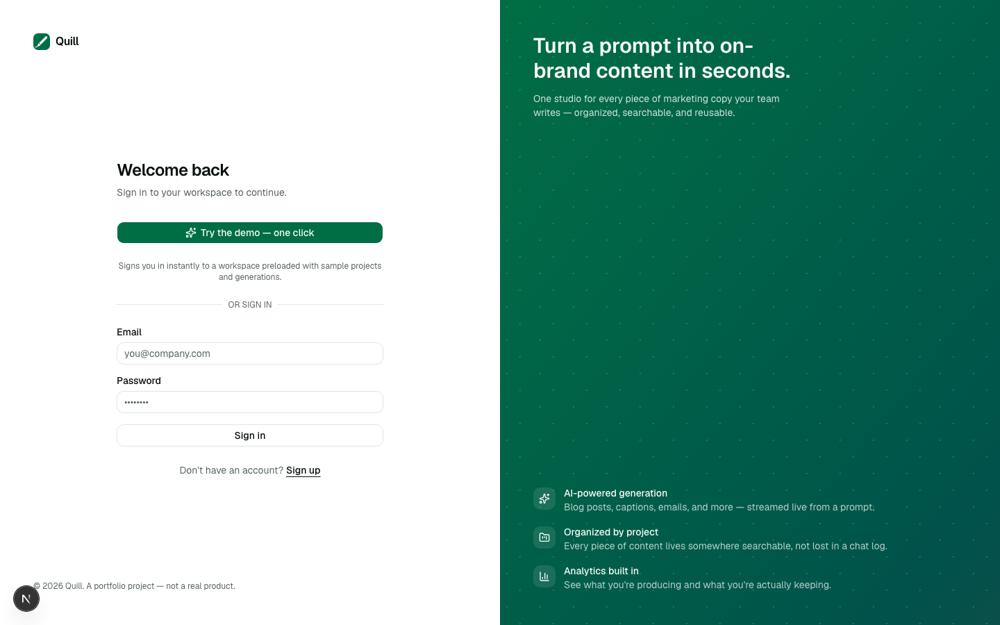
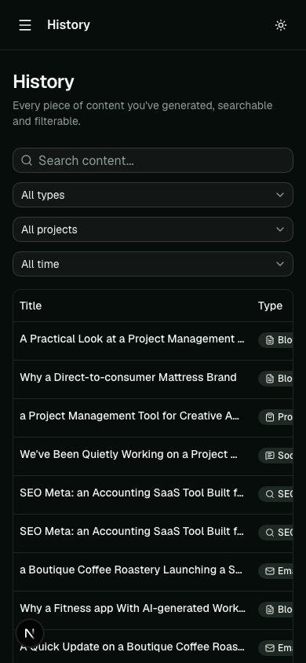

<div align="center">

# Quill

**An AI content studio — generate, organize, and review on-brand marketing copy, with a live-streaming AI interface and zero-cost demo deployment.**

[](https://github.com/Luanafrtd/ai-content-studio/actions/workflows/ci.yml)


[Live demo](https://ai-content-studio-kohl.vercel.app) · [Case study](./CASE_STUDY.md) · [Report an issue](https://github.com/Luanafrtd/ai-content-studio/issues)

</div>

---

Quill is a portfolio project built to look, feel, and behave like a real SaaS product — not a scaffold. It's a full AI content studio with authentication, protected routes, project-based organization, a live-streaming AI generation interface, searchable history, favorites, and an analytics dashboard, backed by a real database and covered by automated tests.

> **Try it instantly:** click **"Try the demo — one click"** on the sign-in screen, or sign up for your own free account. No API key, no billing, no setup — generation runs on a built-in mock AI provider by default.

## Screenshots

| Landing page | Dashboard (dark) |
| --- | --- |
|  |  |

| Dashboard (light) | Generate |
| --- | --- |
|  |  |

| History | Analytics |
| --- | --- |
|  |  |

| Sign in | Mobile |
| --- | --- |
|  |  |

## Features

- **AI-powered generation** — seven content types (blog post, social caption, email, product description, ad copy, SEO meta, press release), streamed live token-by-token from a single prompt
- **Zero-cost by default** — a deterministic mock AI provider ships as the default, so the app runs and demos fully with **no API key required**; set `ANTHROPIC_API_KEY` or `OPENAI_API_KEY` to switch live generation over to a real model with no code changes
- **Authentication** — self-service email/password signup via Auth.js (Credentials provider), plus a seeded, one-click demo account
- **Route protection** — Edge middleware guards every `/dashboard/*` route and redirects back to the original destination after login
- **Project-based organization** — every generation lives inside a project, not scattered across a chat log
- **Search & filtering** — full-text search plus filters by content type, project, favorite status, and date range
- **Favorites** — star the pieces worth reusing and pull them up instantly
- **Analytics dashboard** — generation volume over time, breakdown by content type, favorite rate, and top templates
- **Dark mode** — system-aware, persisted, no flash of unstyled content
- **Responsive** — usable end to end on mobile, with a slide-out nav drawer
- **Accessible (WCAG AA)** — semantic landmarks, visible focus states, labeled forms with inline errors, skip-to-content link, an `aria-live` region on the streaming output, chart data mirrored in screen-reader-only captions
- **Automated tests** — 60 unit tests (Vitest + Testing Library) and 12 end-to-end tests (Playwright) covering auth, signup, route protection, the full generate → history → favorites flow, and search/filtering
- **CI/CD** — GitHub Actions runs lint, format check, typecheck, unit tests, a production build, and the full Playwright suite on every push — with no AI API key required anywhere in CI

## Tech stack

| Layer | Choice |
| --- | --- |
| Framework | [Next.js 15](https://nextjs.org) (App Router, React 19, TypeScript strict) |
| Styling | [Tailwind CSS v4](https://tailwindcss.com) + [shadcn/ui](https://ui.shadcn.com) (Radix primitives) |
| Auth | [Auth.js v5](https://authjs.dev) (Credentials provider, JWT sessions) |
| Database | [Prisma ORM](https://www.prisma.io) + SQLite (swappable to Postgres — see below) |
| AI | Pluggable provider interface — mock by default, [Anthropic](https://www.anthropic.com) / [OpenAI](https://openai.com) behind an env var |
| Server state | [TanStack Query](https://tanstack.com/query) |
| Client state | [Zustand](https://zustand-demo.pmnd.rs) |
| Forms & validation | [React Hook Form](https://react-hook-form.com) + [Zod](https://zod.dev) |
| Tables | [TanStack Table](https://tanstack.com/table) v8 |
| Charts | [Recharts](https://recharts.org) |
| Unit/component tests | [Vitest](https://vitest.dev) + [Testing Library](https://testing-library.com) |
| E2E tests | [Playwright](https://playwright.dev) |

See [CASE_STUDY.md](./CASE_STUDY.md) for the reasoning behind each of these choices and the tradeoffs involved.

## Getting started

### Prerequisites

- Node.js 20+
- npm

### Setup

```bash
git clone https://github.com/Luanafrtd/ai-content-studio.git
cd ai-content-studio
npm install
cp .env.example .env
npx auth secret   # writes a fresh AUTH_SECRET into .env
npm run db:push
npm run db:seed
npm run dev
```

Open [http://localhost:3000](http://localhost:3000) and sign in with the one-click demo account, or register your own.

No external services, API keys, or database server are required — the default setup uses a local SQLite file and a built-in mock AI provider.

### Unlocking real AI generation (optional)

Add either key to `.env` and restart the dev server — no code changes needed:

```bash
ANTHROPIC_API_KEY="sk-ant-..."
# or
OPENAI_API_KEY="sk-..."
```

Anthropic takes priority if both are set. See [`src/lib/ai/index.ts`](./src/lib/ai/index.ts).

To verify a real provider actually works end to end (streams real content, not just that the code compiles):

```bash
ANTHROPIC_API_KEY="sk-ant-..." npx tsx scripts/verify-ai-provider.ts
```

Or run `npm run test:integration` — real, network-hitting tests against whichever key is set, skipped entirely (exit 0) when neither key is present, so this never runs in CI or for anyone without their own key.

## Available scripts

| Script | Description |
| --- | --- |
| `npm run dev` | Start the dev server |
| `npm run build` | Production build (also runs `prisma generate`) |
| `npm run start` | Serve the production build |
| `npm run lint` | ESLint |
| `npm run typecheck` | `tsc --noEmit` |
| `npm run format` / `format:check` | Prettier |
| `npm run test` / `test:watch` / `test:coverage` | Vitest unit tests |
| `npm run test:e2e` | Playwright end-to-end tests |
| `npm run test:integration` | Real Anthropic/OpenAI API tests — requires your own key, skipped otherwise |
| `npm run db:push` | Sync the Prisma schema to the database |
| `npm run db:seed` | Seed realistic demo data |
| `npm run db:reset` | Force-reset the schema and reseed (destructive, local only) |
| `npm run db:seed:prod` | Reseed and refresh `prisma/prod-seed.db`, the committed snapshot used by the live deployment |
| `npm run db:studio` | Open Prisma Studio |
| `npm run brand:generate` | Regenerate favicon/app-icon/OG-image assets from `src/app/icon.svg` |

## Project structure

```
src/
  app/
    (auth)/login/, (auth)/register/    Sign-in and signup pages
    (dashboard)/dashboard/             Protected app shell: overview, projects, generate, history, favorites, analytics
    api/                               Route handlers (projects, content, generate, analytics, auth)
    page.tsx                           Public marketing landing page
  components/
    ui/                                shadcn/ui primitives
    layout/                            Sidebar, topbar, mobile nav, theme toggle
    generate/ content/ projects/ dashboard/ marketing/   Feature components
    shared/                            Reusable table/empty-state/search/pagination pieces
  hooks/                               TanStack Query hooks per resource, plus the streaming use-generate hook
  lib/
    ai/                                Provider interface, mock/Anthropic/OpenAI providers, factory, rate limiter
    validations/                       Zod schemas, shared client + server
  store/                               Zustand stores
  middleware.ts                        Route protection
prisma/
  schema.prisma                        Data model
  seed.ts                              Faker-based seed script (reuses the mock AI generator for realistic content)
tests/
  unit/                                Vitest + Testing Library
  e2e/                                 Playwright
```

## Testing

```bash
npm run test        # unit tests
npm run test:e2e     # end-to-end tests (starts its own dev server + reseeds the DB)
```

Playwright tests run serially against a single seeded SQLite file to avoid write contention, and reset the database to a known state before the suite runs via `tests/e2e/global-setup.ts`. The full generation flow (create project → generate → appears in history → favorite → appears in favorites → search/filter) runs against the mock AI provider, so it's fast, deterministic, and needs no secrets in CI.

## Deployment

This repo deploys to [Vercel](https://vercel.com) out of the box:

1. Import the repository in Vercel.
2. Set the environment variables below.
3. Deploy.

### Environment variables

| Variable | Local dev | Production |
| --- | --- | --- |
| `DATABASE_URL` | `file:./dev.db` | `file:/tmp/dev.db` (see below) or a Postgres connection string |
| `AUTH_SECRET` | any string (`npx auth secret`) | a strong secret |
| `NEXTAUTH_URL` | `http://localhost:3000` | your production URL |
| `NEXT_PUBLIC_SITE_URL` | optional, defaults to `http://localhost:3000` | your production URL — used for `metadataBase` (canonical/OG URLs) |
| `ANTHROPIC_API_KEY` / `OPENAI_API_KEY` | optional | optional — unlocks real AI generation |
| `UPSTASH_REDIS_REST_URL` / `UPSTASH_REDIS_REST_TOKEN` | optional | optional — switches the generation rate limiter from in-memory to a real distributed limiter (see below) |

### About the SQLite deployment

Vercel's serverless filesystem is read-only outside of `/tmp`. To keep the "zero-config, no account required" spirit of this project all the way to production, `src/lib/prisma.ts` detects a `file:/tmp/...` database URL and copies a pre-seeded snapshot (`prisma/prod-seed.db`, committed to the repo) into place on cold start. Data is fully live and writable — but a given serverless instance's writes reset the next time that instance cold-starts.

That's a deliberate, honest tradeoff for a demo deployment, not a limitation of the app itself. **For genuine write persistence, point `DATABASE_URL` at a real Postgres database** (Vercel Postgres, Neon, Supabase, etc.) and change one line in `prisma/schema.prisma`:

```diff
 datasource db {
-  provider = "sqlite"
+  provider = "postgresql"
   url      = env("DATABASE_URL")
 }
```

No application code changes are required — every query goes through Prisma. See [CASE_STUDY.md](./CASE_STUDY.md#data-layer-prisma--sqlite-one-line-from-postgres) for the full reasoning.

### About rate limiting

`/api/generate` is rate-limited to 30 requests/hour/user. By default that's enforced with an in-memory counter, which works locally but is per-instance on Vercel serverless — it doesn't hold up across cold starts or multiple concurrent instances. Add an Upstash Redis database (Vercel → your project → Storage tab → free tier) and set `UPSTASH_REDIS_REST_URL`/`UPSTASH_REDIS_REST_TOKEN` to switch to a real sliding-window limiter backed by Redis, with no code changes — see [`src/lib/ai/rate-limiter.ts`](./src/lib/ai/rate-limiter.ts).

## Accessibility

Built to WCAG AA: semantic landmarks and heading structure, labeled form fields with inline `role="alert"` errors, visible focus rings, a skip-to-content link, and screen-reader-only text summaries for every chart. The live-streaming generation output is a single `aria-live="polite"` region, so a screen reader announces the finished result rather than firing on every ~20ms text chunk. The template gallery is a real `radiogroup`, fully operable by keyboard.

## License

MIT — this is a portfolio project, not a production product. Feel free to use it as a reference or starting point.
